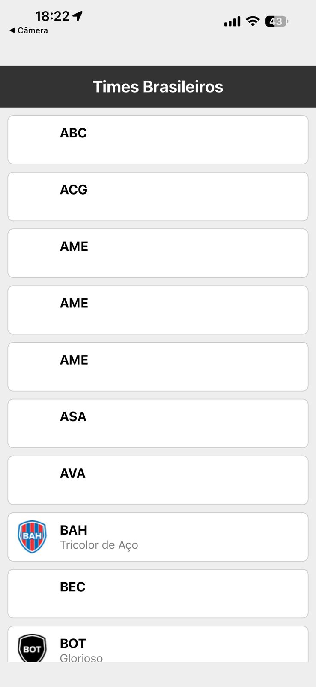
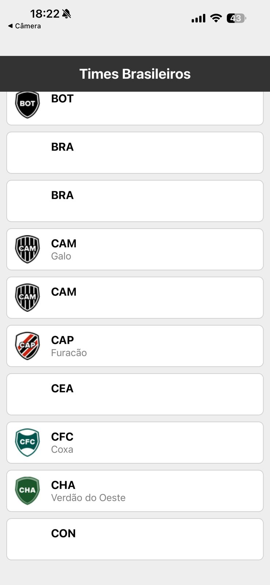
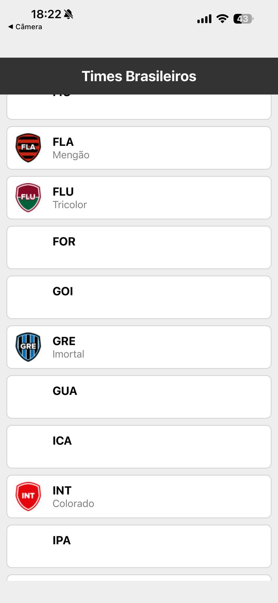

projeto flatList - times do brasileirão

Este é um projeto simples onde eu criei um aplicativo para listar os times de futebol usando uma API pública. o objetivo foi praticar o uso de listas (`FlatList`) e consumo de APIs (`fetch`) no React Native.

tecnologias usadas
- **React Native**: para criar a interface do aplicativo para celular.
- **Expo**: para facilitar o desenvolvimento e testar o app mais rápido.
- **JavaScript**: linguagem principal usada no código.

API utilizada
eu usei a API pública do **Cartola FC** (da Globo) para buscar os dados dos clubes, como o nome, escudo e apelido de cada time.
- **Endpoint usado**: `https://api.cartola.globo.com/clubes`

como rodar o projeto
1. Abra o terminal na pasta do projeto e instale as dependências:
   ```bash
   npm install
   ```
2. Inicie o servidor do Expo:
   ```bash
   npx expo start
   ```
3. Leia o QR Code com o aplicativo Expo Go no seu celular, ou aperte `a` para rodar no emulador Android e `i` para o emulador de iOS.

## prints do app

<p align="center">
  
  
  
  
</p>
